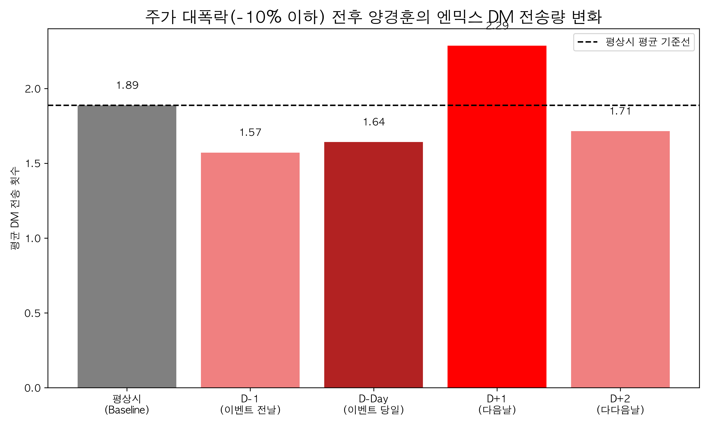
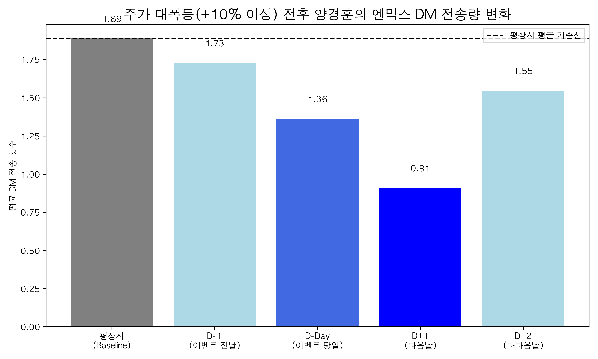

# 📈 Stock_NMIXX: 포트폴리오 수익률과 팬심의 상관관계 분석

> **"계좌가 파란색일 때, 그의 팬심은 더 뜨거워지는가?"** > 본 프로젝트는 개인의 주식 포트폴리오 수익률과 엔믹스(NMIXX) DM 전송량 사이의 정서적 상관관계를 데이터로 입증합니다.

---

## 🧐 Motivation
팔란티어가 급락하는 날. 그의 엔믹스관련 DM은 폭주했다.
NMIXX는 그에게 어떤 존재일까. 
나는 알았다. "마지막 희망. 동아줄..!"

주가가 폭락한 날 유독 NMIXX 관련 DM을 많이 보낸다는 가설을 세웠고, 이를 증명하기 위해 1년간의 데이터를 하나하나 수집하여 분석하게 되는데 ...

## 🛠️ Tech Stack
- **Language**: Python 3.x
- **Libraries**: `pandas`, `yfinance`, `matplotlib`, `scipy`
- **Data Source**: 개인 인스타그램 DM JSON, Yahoo Finance

## ⚙️ Data Pipeline
1. **01_extract_dms.py**: 원본 JSON에서 엔믹스 멤버별 DM 데이터 추출 및 일일 빈도 계산.
2. **02_data_preprocessing.py**: 텍스트 클리닝 및 날짜 포맷 표준화.
3. **03_calc_stock_return.py**: `yfinance`를 활용, 매수/매도 수량 변화를 반영한 **실질 일일 수익률(True Return)** 산출.
4. **04_merge_datasets.py**: 주가 데이터와 DM 데이터를 날짜 기준으로 정렬 및 병합.
5. **05_visualize_trends.py**: 전체 기간의 시계열 추세 시각화.
6. **06_analyze_correlation.py**: 피어슨/스피어만 통계 검정 및 이벤트 분석(Event Study) 수행.

---

## 📊 Analysis Results

### 1. 통계적 상관계수 (Correlation)
- **Pearson/Spearman p-value > 0.05**: 일반적인 소폭 변동 시에는 주가와 DM 사이에 유의미한 상관관계가 발견되지 않았습니다. (일상적인 평정심 유지)

### 2. 이벤트 분석 (Event Study)
특정 변동폭(±10%) 이상의 '사건'이 발생했을 때의 행동 변화입니다.

#### 📉 Case A: 주가 대폭락 (-10% 이하)
- **결과**: 폭락 당일보다 **다음 날(D+1)** DM 전송량이 평소 대비 **1.2배 상승**.
- **해석**: 즉각적인 충격 이후 찾아오는 '현타'를 엔믹스를 통해 치유하려는 행동 패턴이 관찰됩니다.

#### 📈 Case B: 주가 대폭등 (+10% 이상)
- **결과**: 폭등 다음 날(D+1) DM 전송량이 평소 대비 **0.5배로 급감**.
- **해석**: 자산 증식의 기쁨이 팬심을 일시적으로 압도하거나, 수익 확인 및 재투자에 집중하느라 덕질 화력이 줄어드는 '현실주의적' 면모가 확인됩니다.

---

## 🏆 Conclusion
데이터 분석 결과, 그에게 엔믹스는 단순한 연예인을 넘어 주식 시장의 하락장에서 멘탈을 잡아주는 '정서적 안전자산'임이 입증되었습니다. 

---
*주의: 본 프로젝트의 데이터(data/)는 개인정보 보호를 위해 비공개 처리되었습니다.*
